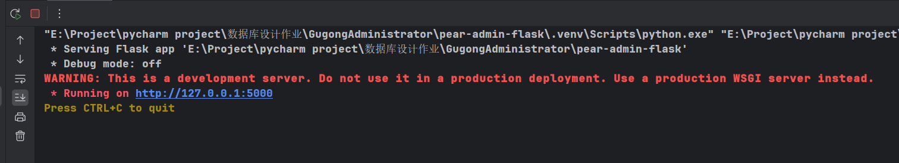
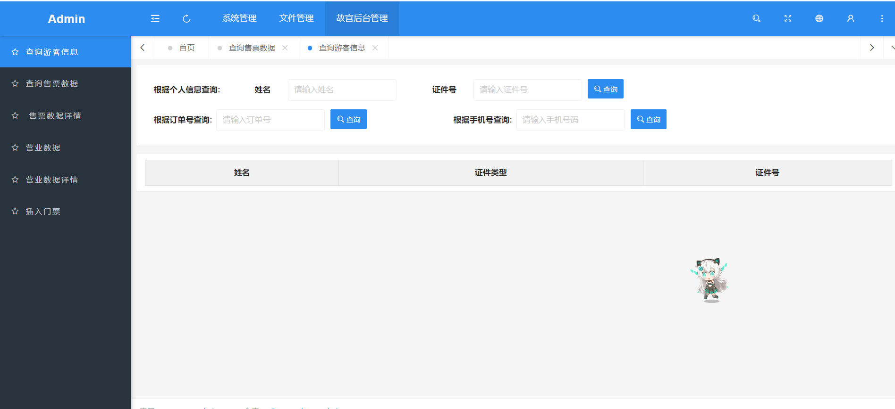
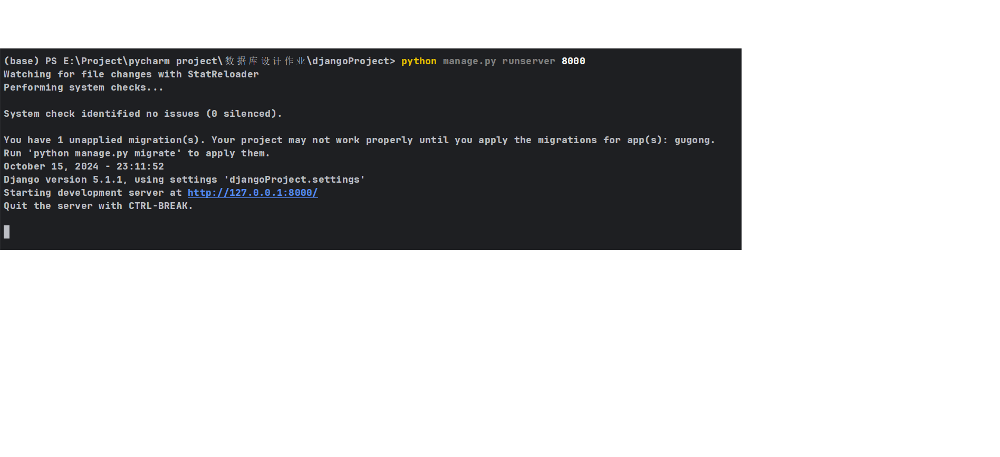
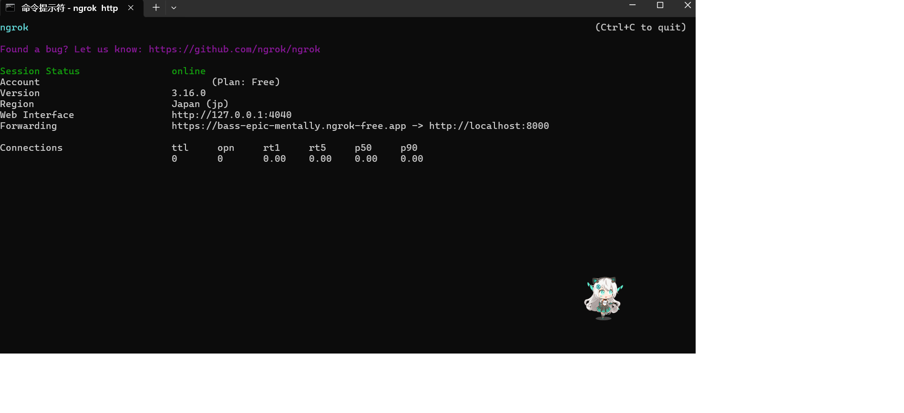
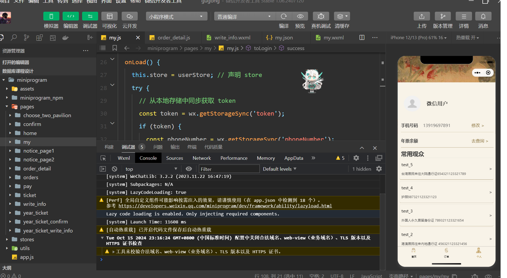

# 项目名称
<div align="center">
<br/>
<br/>
  <h1 align="center">
    Forbidden City Ticket Booking System
  </h1>
  <h4 align="center">
    完全仿制故宫博物馆微信小程序的订票系统
  </h4> 
</div>

<div align="center">
  
</div>

**请您点个 Star 多谢！🎉**
## 项目背景

这是大三数据库设计大作业的项目，旨在通过设计一个完整的数据库系统来提升我们的数据库理论与实践能力。
## 项目介绍
该项目旨在实现一个前后端分离、用于管理故宫博物馆门票的系统和一个管理员后台系统。用户可以对该系统进行个人信息填写、常用观众信息填写、门票查询、购买和查看订单记录等操作。管理员可以通过根据多种选项查询游客信息、查询每日、月、年的售票数据、统计营业数据、插入每天每种门票的数据。
## 技术结构
- **前端**：使用微信小程序开发工具进行开发。
- **后端**：使用Django, Flask行开发。
- **数据库**：使用MySQL进行数据存储。
## 业务结构
- **用户模块**：用户注册、登录、信息管理。
- **门票管理模块**：门票的查询、购买、管理。
- **数据统计模块**：数据的统计分析，提供决策支持。

## 业务流程
#### 用户:
1. 用户点击个人界面的登录按钮, 自动注册并登录系统。
2. 用户从首页的购票按钮进行浏览可用的门票信息。
3. 用户选择门票并进行购买。
4. 系统生成订单, 用户可以在订单界面进行查看订单详情功能。
#### 管理员:
1. 从后台找到对应的界面,进行查找和修改
## 项目展示


####  整个项目结构

```
该项目
├─GugongAdministrator/pear-admin-flask  # 管理员前后端的实现 来源于https://github.com/pearadmin/pear-admin-flask
│
├─command  # 存放一些项目启动和设定的命令
|
├─MySQL_database  # 数据库测试与visio图
│
├─djangoProject  # 订票系统后端（Django）
│  
└─数据库课程设计  # 微信小程序前端 (微信小程序开发工具)

```
####  GugongAdministrator/pear-admin-flask项目结构

```
GugongAdministrator/pear-admin-flask
├─applications  # 应用
│  ├─common # 配置文件
│  │   └─script
│  │       └─admin.py  # 请在这里配置好默认管理员、页面调度
│  ├─extensions  # 注册插件
│  └─models  # 数据模型(只标注了拓展部分)
│      └─gugong.py  # 故宫数据库结构,方便其他文件调用
│  ├─views  # 视图部分(只标注了拓展部分)
│  │   ├─plugin 
│  │   └─system 
│  │       ├─__init__.py  # 注册蓝图，以组织和管理多个模块的路由 (拓展时修改) 
│  │       ├─business_data.py # 营业数据统计
│  │       ├─business_data_detail.py  # 营业数据详情(按票型分类)
│  │       ├─insert_ticket_data.py  # 插入、新建余票界面后端逻辑
│  │       ├─query_sale_data.py  # 根据信息查询游客信息界面后端逻辑
│  │       ├─query_sale_detail.py  # 售票数据(微观)后端逻辑
│  │       └─query_tourist.py  # 售票数据查询(宏观)后端逻辑
│  └─ config.py  # 配置文件对象, 请在这里配置好您的数据库、密钥!!!
├─docs  # 文档说明（占坑）
├─migrations  # 迁移文件记录
├─plugins  # 
├─static  # 静态资源文件
├─templates  # 静态模板文件
│  ├error  # 报错页面
│  └─system  # 正常的页面(只标注了拓展部分)  
│      ├─business_data  # 营业数据
│      ├─business_data_detail  # 营业数据详情
│      ├─insert_ticket_data  # 插入,新建余票界面
│      ├─query_information  # 根据信息查询游客信息界面
│      ├─query_sale_data  # 售票数据查询(宏观)
│      └─query_sale_detail  # 售票数据(微观) 
├─app.py  # 应用程序的入口点
├─MySQL_connect_test.py  # 数据库连接测试
├─requirement.txt  # 依赖文件
└─test.py # 测试文件夹（测试一段字符对应的哈希密码）
```
####  内置功能
##### 原有:
- [x] 用户管理：用户是系统操作者，该功能主要完成系统用户配置。
- [x] 权限管理：配置系统菜单，操作权限，按钮权限标识等。
- [x] 角色管理：角色菜单权限分配。
- [x] 操作日志：系统正常操作日志记录和查询；系统异常信息日志记录和查询。
- [x] 登录日志：系统登录日志记录查询包含登录异常。
- [x] 文件上传:  图片上传示例
- [x] 定时任务:  简单的定时任务
##### 新加:
- [x] 管理员操作: 插入余票,根据多种选项查询游客信息; 查询每日、月、年的售票数据；统计营业数据；插入每天每种门票的数据。

####  djangoProject项目结构
```
djangoProject
├─djangoProject
│  ├─settings.py  # 请在这里配置您的项目
│  └─ urls.py  # 页面路由设置
├─gugong  # 文档说明（占坑）
│  ├─management  #
│  │   └─ commands  # 控制命令
│  │         ├─create_daily_quota.py  # 创建指定日期的余票
│  │         ├─load_ticket_types.py  # 一键初始化TicketType表
│  │         ├─refund_order.py  # 退指定订单id的订单  
│  │         ├─reset_year_ticket_quota.py  # 重置所有的年票
│  │         ├─set_year_ticket_quota.py  # 输入电话号为绑定该电话号的用户设置年票余额
│  │         ├─update_daily_quota.py  # 更新指定的余票
│  │         └─update_order_status.py  # 更新指定订单的状态为已核销(检票用)
│  ├─migrations  # 迁移文件记录
│  ├─apps.py  # app启动类
│  ├─models.py  # 对数据库操作
│  ├─signals.py  # 让信号在所有模型迁移完成后触发
│  ├─tasks.py  # 自定义任务(半小时支付检测)
│  └─views.py  # 处理用户请求并返回响应的核心文件
└─manage.py # 项目的命令行工具
```
####  内置功能
- [x] 微信登录：获取openid,并创建空表
- [x] 更新电话号码
- [x] 更新常用观众信息
- [x] 删除常用观众信息
- [x] 添加访客信息
- [x] 创建订单信息
- [x] 用户确认订单
- [x] 退票
- [x] 获取故宫可用余票 
- [x] 获取其他馆可用余票
- [x] 年票订单确认
- [x] 年票退票
- [x] 年票查询

####  数据库课程设计项目结构
```
数据库课程设计
├─miniprogram  # 应用
│  ├─assets  # 配置文件
│  │  └─ images  # 图片文件
│  ├─miniprogram_npm  # 导入的库
│  ├─pages  # 数据模型
│  │  ├─choose_two_pavilion  # (购票)选择两馆
│  │  ├─confirm  # (购票)确认订单
│  │  ├─home  # 主页
│  │  ├─my  # 个人界面
│  │  ├─notice_page1  # (轮播图)对应页面
│  │  ├─notice_page2  # (轮播图)对应页面
│  │  ├─orders  # 订单记录
│  │  ├─pay  # (购票)支付
│  │  ├─ticket  # (购票)选择日期和票种
│  │  ├─write_info  # (购票)填写个人信息
│  │  ├─year_ticket  # 年票订票
│  │  ├─year_ticket_confirm  # 年票订单确认
│  │  └─ year_ticket_write_info  # 年票信息填写
│  ├─stores  # 存储信息的文件
│  ├─app.js  # 小程序的主 JavaScript 文件
│  ├─app.json  # 小程序的全局配置文件
│  ├─app.wxss  # 小程序的全局样式表文件
│  ├─project.config.json  # 项目的配置信息
│  ├─project.private.config.json  # 存储敏感信息或开发环境的设置
│  └─sitemap.json  # 用于配置小程序的页面爬虫
└─其余文件  # 因为该项目是由另一个项目修改而来,可能会有一些多余的文件
```
####  内置功能

- [x] 参考故宫微信小程序的操作
- [x] 电话信息：个人开发者无法调用getphonenumber接口,只能手动输入。


## 项目配置？
#### 修改配置
#### MySql配置信息
```
GugongAdministrator/pear-admin-flask/applications/config.py
```
请先创建数据库, 并用 Django orm 架构命令生成,然后在这里配置你本地的 MySQL ,请根据注释修改对应的值

#### Django配置信息
```
djangoProject/djangoProject/settings.py
```
输入你的MySQL密码,修改对应配置

### 数据库课程设计
配置信息
project.config.json里面输入你的appid


## 如何快速上手这个项目？
- 请参考下方的启动指南:
#### 项目安装
```
git clone https://github.com/Titan-maverick/Forbidden-City-Ticket-Booking-System.git
```
或者直接下载zip, 然后 GugongAdministrator,djangoProject 用支持 python 的编译器打开(pycharm), 数据库课程设计 用 微信开发工具 打开
##### 配置环境
GugongAdministrator,djangoProject
```
pip install -r requirements.txt
```
##### 配置数据库
用 MySQL_database 文件夹下面的 数据库创建与删除.sql 创建数据库,然后配置好 djangoProject ,最后用 command.md 里面的第三, 四条命令对表进行构建


### 如何启动项目

#### 后端
djangoProject用command内的命令在终端启动
##### 内网穿透
推荐ngork, [链接](https://ngrok.com/).
[教学]([https://ngrok.com/](https://blog.csdn.net/sinat_41034328/article/details/134026644/)).
获得密钥, 将djangoProject启动采用的端口号设置到公网
#### 前端
用微信开发工具打卡数据库课程设计文件,直接编译,在调试窗口进行操作
[平台链接]([https://ngrok.com/](https://mp.weixin.qq.com/)).
#### 管理员平台
GugongAdministrator直接运行app.py


## 预览项目
### 管理员平台
<div align="center">
  
</div>
<div align="center">
  
</div>

### Django后端
<div align="center">
  
</div>

### ngork
<div align="center">
  
</div>

### 微信开发工具
<div align="center">
  
</div>
